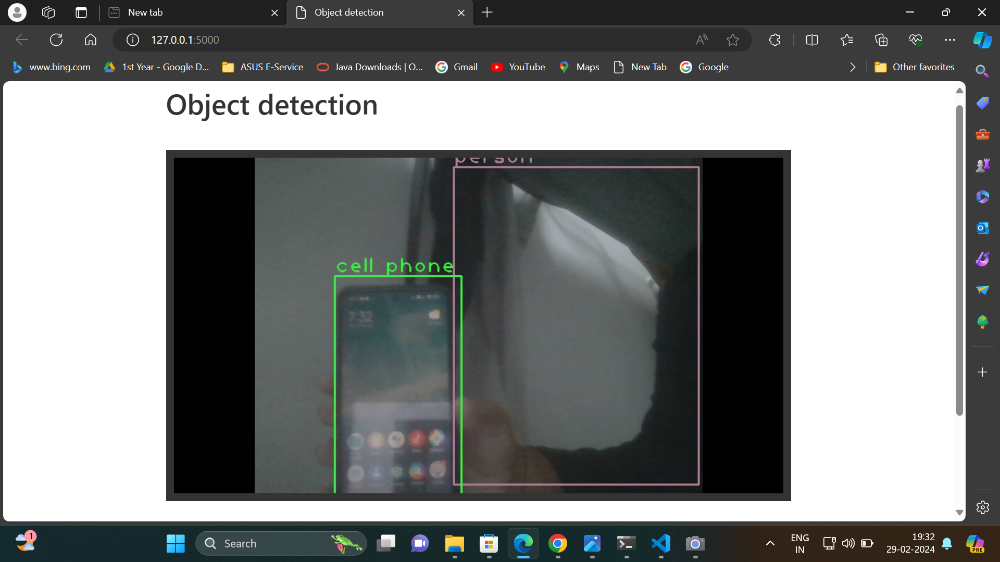

# Object Detection Project

## Introduction

Welcome to the Object Detection Project documentation. This project focuses on implementing real-time object detection using the YOLOv3 algorithm, managing camera settings, and providing a user-friendly web interface for interaction. This document provides a detailed overview of the project, including its objectives, key features, technologies used, project components, and demonstrations with embedded screenshots.

## Project Overview

Object detection plays a crucial role in various domains such as security surveillance, autonomous vehicles, and retail analytics. Our project aims to showcase the capabilities of object detection algorithms, particularly YOLOv3, in real-world scenarios. By detecting and identifying objects in images or video streams, we can automate tasks, enhance safety, and improve efficiency. The project offers a comprehensive solution that integrates object detection with camera settings management and provides a user-friendly interface for easy interaction.

## Key Features

### 1. Real-time Object Detection
- Utilizes YOLOv3 algorithm for real-time object detection in live video streams.
- Accurately detects and identifies objects, enabling automated analysis of visual data.

### 2. Camera Settings Management
- Allows users to control camera settings such as exposure and contrast.
- Provides options to adjust camera settings based on specific requirements.

### 3. User-friendly Web Interface
- Offers an intuitive web interface for interacting with the system.
- Enables users to toggle object detection, adjust camera settings, and view live video streams seamlessly.

## Technologies Used

The project leverages a combination of technologies to deliver its functionality:

- **Python**: Primary programming language for development.
- **OpenCV (cv2)**: Library for handling video streams, image processing, and interfacing with cameras.
- **Flask**: Web framework used to create the user interface.
- **HTML/CSS/JavaScript**: Languages for designing the web interface and handling user interactions.
- **Bootstrap**: Toolkit for styling and enhancing the appearance of the web application.
- **Requests**: Library for downloading external resources, used for obtaining the YOLOv3 weights file.

## Project Components

### 1. Camera Settings Management Functions

- **`check_settings()`**: Checks and saves current camera settings to a log file.
- **`reset_settings()`**: Resets camera settings to values stored in the log file.

### 2. Object Detection Class (`ObjectDetection`)

- Performs real-time object detection using the YOLOv3 algorithm.
- Detects objects in video frames and draws bounding boxes and labels.

### 3. Video Streaming Class (`VideoStreaming`)

- Initializes a video stream and provides methods for controlling camera settings and object detection.
- Streams video feed with specified modifications and allows users to interact with the stream through the web interface.

### 4. Flask Application

- Provides routes for rendering the home page, streaming the video feed, and handling button requests for camera settings adjustments.

### 5. HTML Template (`index.html`)

- User-friendly interface for controlling camera settings and object detection toggles.
- Includes buttons for preview, horizontal flip, object detection model, exposure adjustment, contrast adjustment, and camera settings reset.

### 6. JavaScript Functions

- Handle button click events in the HTML template.
- Send asynchronous requests to Flask routes for camera settings adjustments.

## Demonstration

### Screenshots

#### Home Page

#### Object Detection Enabled

## Conclusion

The Object Detection Project serves as a practical demonstration of applying computer vision techniques to solve real-world problems. By integrating object detection with camera settings management and providing a user-friendly web interface, the project offers a comprehensive solution for automated analysis of visual data. For further details and demonstration, please refer to the project code and documentation.

